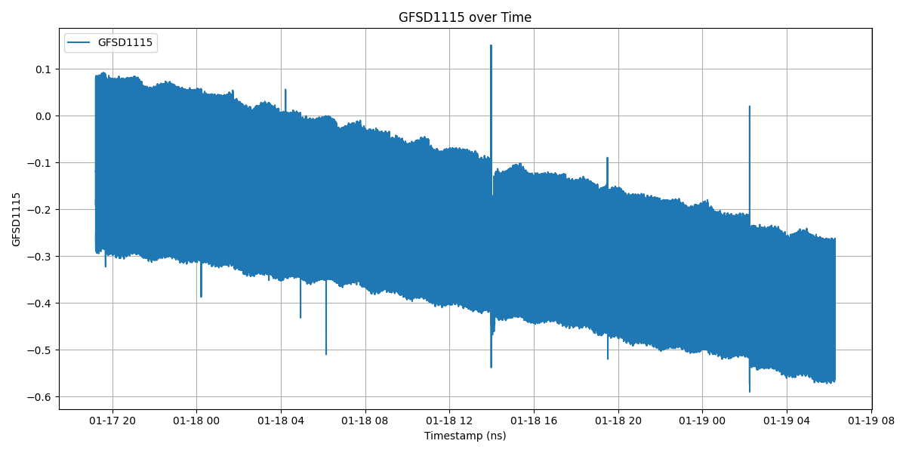
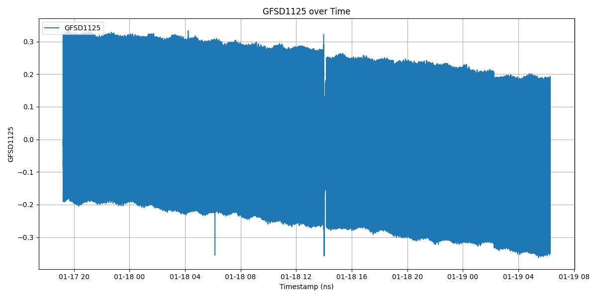
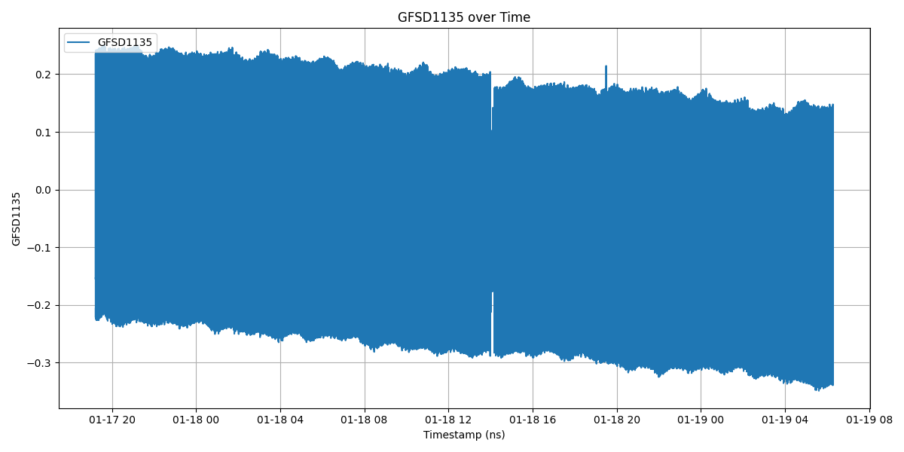

# Gaia Forecasting

## Project Overview

Gaia Forecasting is a project aimed at forecasting data using various tools and libraries. 

## Project Structure

### Data

- **data/pre-processed/**: Contains pre-processed data files in CSV format.
- **data/raw/**: Contains raw data files.

### Source Code
- **src/python/**: Contains Python source code for the project.
- **src/rust/**: Contains Rust source code for the project.

## Installation

Create a python environment:

```sh
python3 -m venv .env
source .env/bin/activate
```

To install the required Python dependencies, run:

```sh
pip install -r requirements.txt
```

## Usage

To generate the csv file, execute the rust program in the folder ``src/rust/json_processor/``:

Compile:

```sh
cargo build --release
```

And execute:

```sh
target/release/json_processor <input_json_file> <output_csv_base_name> <max_lines_per_file>
```

For instance:

```sh
cargo run --release -- ../../../data/raw/example.json ../../../data/pre-
processed/example.csv 2000000
```

It will generate the CSV ``data/pre-processed/example.1.csv``

We can plot the data and generate statistics with ``src/python/plot_data.py`` and ``src/python/data_stat.py``, respectively.

## Data analysis






